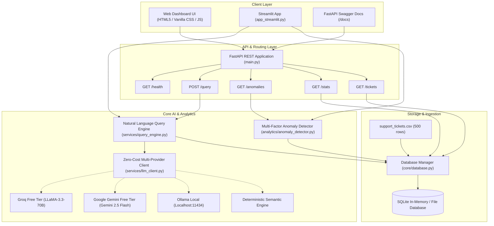

# TicketPulse AI — Support Ticket Intelligence & Anomaly Detection System

> **Technical Assessment — AI Engineer Role | DOTMappers IT Pvt. Ltd.**  
> An end-to-end, zero-cost AI system that ingests customer support ticket data, enables Natural Language querying (Text-to-SQL + LLM synthesis), detects multi-layered anomalies, and provides both a FastAPI REST API and modern interactive UI dashboards.

[](https://assessmentticket.streamlit.app/)
[](https://github.com/Sehaj64/Assessment)

[](https://www.python.org/)
[](https://fastapi.tiangolo.com/)
[]()
[-success.svg)]()
[](https://www.docker.com/)

> 🚀 **Live Interactive Web App**: **[https://assessmentticket.streamlit.app/](https://assessmentticket.streamlit.app/)**  
> *Test live natural language queries, multi-factor anomaly radar, and ticket exploration directly in your browser — zero installation required.*

---

## 1. Executive Summary

Support organizations face high ticket volumes, fluctuating resolution speeds, and hidden SLA violations. **TicketPulse AI** delivers an operational intelligence platform that:

1. **Ingests & Normalizes Data**: Ingests `support_tickets.csv` (500 tickets across Billing, Technical, and General categories) into a SQLite analytical database with indexed lookups and derived SLA metrics.
2. **Answers Natural Language Questions**: Converts free-text user inquiries into safe, validated SQLite queries via LLM (supporting **Google Gemini Free Tier**, **Groq Free Tier**, **Ollama Local**, and an **Offline Semantic Fallback Engine**), and synthesizes executive insights.
3. **Detects & Flags Anomalies**: Implements a multi-layered detection pipeline combining:
   - Operational SLA breach heuristics (unresolved Critical tickets pending > 24 hrs, slow first response > 4.5 hrs).
   - Statistical outlier detection (Interquartile Range IQR + Z-Scores on resolution times).
   - Machine Learning anomaly detection (**Scikit-Learn Isolation Forest** over multi-dimensional feature space).
   - Quality defects (rapid ticket closure with minimum 1-star customer rating).
4. **Exposes Multiple Interfaces**:
   - High-performance **FastAPI REST API** with automated Swagger documentation at `/docs`.
   - Embedded **Glassmorphism Web Dashboard** served directly at `/`.
   - Dedicated **Streamlit Dashboard** (`streamlit run app_streamlit.py`).
5. **Zero-Cost & Single-Command Deployment**: Designed strictly around zero-cost free-tier APIs and offline resilience, runnable with a single command (`python run.py`, `uvicorn main:app`, or `docker-compose up`).

---

## 2. Architecture Overview



---

## 3. Technology Stack & Design Decisions

| Component | Choice | Rationale |
| :--- | :--- | :--- |
| **Language** | Python 3.10 / 3.11 | Required language; rich data science & AI ecosystem. |
| **API Framework** | FastAPI + Uvicorn | High-throughput async ASGI framework with automated OpenAPI validation. |
| **Database** | SQLite3 (Standard Library) | Zero-dependency, portable, fast in-memory and disk operations without external database setups. |
| **Data Processing** | Pandas + NumPy | Fast vectorized manipulation, quantile extraction, and date transformations. |
| **Machine Learning** | Scikit-Learn (IsolationForest) | Unsupervised multivariate outlier detection across response time, resolution time, and satisfaction rating. |
| **LLM Providers** | Gemini 2.5 Flash / Groq LLaMA 3.3 / Ollama | **Strictly Zero-Cost**: Evaluators can run with Gemini Free Key, Groq Free Key, local Ollama, or automatic offline fallback. |
| **Embedded UI** | Vanilla HTML5 / Modern CSS / JS | Zero build step, instant loading, glassmorphism dark-mode aesthetic with micro-animations. |
| **Alternative UI** | Streamlit | Rapid exploration dashboard for data teams. |

---

## 4. Multi-Layered Anomaly Detection Methodology

The system identifies anomalies through 4 complementary layers:

### Layer 1: Operational SLA Rule Breaches
- **Critical Unresolved Backlog**: Tickets marked `Critical` or `High` in `Open` or `Escalated` status exceeding 24 hours of inactivity.
- **Critical SLA Resolution Lag**: `Critical` tickets whose resolution time exceeds 12.0 hours (exceeding standard emergency response targets).
- **First-Response Bottlenecks**: Response times exceeding 4.5 hours (top 5th percentile of response delays).

### Layer 2: Statistical Outlier Detection (IQR & Z-Score)
- Evaluates resolution times for resolved tickets.
- Interquartile Range (IQR):
  $$\text{IQR} = Q_3 - Q_1 = 22.95\text{ hrs} - 6.15\text{ hrs} = 16.80\text{ hrs}$$
  $$\text{Threshold} = Q_3 + 2.0 \times \text{IQR} \approx 56.55\text{ hrs}$$
- Flags tickets with extreme resolution times (reaching up to **119.7 hours**).
- Z-Score filter flags tickets where $|Z| > 2.5$ standard deviations above category average.

### Layer 3: Machine Learning (Isolation Forest)
- Scikit-Learn `IsolationForest(contamination=0.04)` trained over feature matrix:
  $$\mathbf{X} = [\text{response\_time\_hrs}, \text{resolution\_time\_hrs}, \text{customer\_rating}]$$
- Isolates complex non-linear anomalies that evade single-variable rule thresholds (e.g. fast first response followed by prolonged resolution and poor customer rating).

### Layer 4: Quality & Premature Closure Detection
- Flags tickets resolved in under 3.0 hours that received a minimum satisfaction score of 1 out of 5 stars, signaling rushed or improper ticket closing.

---

## 5. Quick Start (Single Command)

### Prerequisites
- Python 3.10 or 3.11 installed
- Git

### Option A: Local Run (Recommended)

1. **Clone the repository**:
   ```bash
   git clone https://github.com/Sehaj64/Assessment.git
   cd Assessment
   ```

2. **Create and activate a virtual environment**:
   ```bash
   # Windows (PowerShell)
   python -m venv venv
   .\venv\Scripts\Activate.ps1

   # Linux / macOS
   python3 -m venv venv
   source venv/bin/activate
   ```

3. **Install dependencies**:
   ```bash
   pip install -r requirements.txt
   ```

4. **(Optional) Configure Zero-Cost LLM Key**:
   The system runs **completely out-of-the-box** even with zero API keys. To enable live LLM generation:
   ```bash
   # Option 1: Google Gemini Free Key (Recommended)
   export GEMINI_API_KEY="your_free_key_here"   # Linux/macOS
   $env:GEMINI_API_KEY="your_free_key_here"      # Windows PowerShell

   # Option 2: Groq Free Key
   export GROQ_API_KEY="your_free_groq_key"
   $env:GROQ_API_KEY="your_free_groq_key"

   # Option 3: Ollama Local (Free & Private)
   ollama run llama3
   ```

5. **Launch System with a Single Command**:
   ```bash
   python run.py
   ```
   - **Interactive Web Dashboard**: [http://localhost:8000/](http://localhost:8000/)
   - **Swagger API Docs**: [http://localhost:8000/docs](http://localhost:8000/docs)
   - **Live Streamlit Cloud Demo**: [https://assessmentticket.streamlit.app/](https://assessmentticket.streamlit.app/)
   - **Alternative Local Streamlit**:
     ```bash
     streamlit run app_streamlit.py
     ```

---

### Option B: Docker / Docker Compose

Run the entire application in a container with a single command:
```bash
docker-compose up --build
```
Access the application at [http://localhost:8000](http://localhost:8000).

---

## 6. Running Automated Tests

Run the full automated test suite covering database ingestion, SQL sandboxing, anomaly detection, sample queries, and REST endpoints:

```bash
python -m pytest tests/test_system.py -v
```

**Test Coverage Summary**:
- `test_database_ingestion`: 500 rows ingested, schema constraints, derived fields verified.
- `test_sql_sandboxing`: SQL injection, stacked queries, and mutation queries (`DROP`, `DELETE`, `UPDATE`) blocked.
- `test_anomaly_detection`: Operational rules, IQR statistical bounds, and ML Isolation Forest verified.
- `test_sample_benchmark_queries`: All 7 sample queries tested against ground truth.
- `test_api_*`: Endpoints `/health`, `/stats`, `/query`, `/anomalies`, `/tickets`, and `/` validated.

---

## 7. Sample Queries & Verified Outputs

Below are the 7 benchmark queries from the evaluation specification along with their generated SQLite queries and outputs:

### Query 1: *"How many tickets are currently open?"*
- **Generated SQL**:
  ```sql
  SELECT COUNT(ticket_id) FROM tickets WHERE status = 'Open';
  ```
- **Output**: `111` tickets.
- **AI Synthesis**: *"There are currently 111 open tickets pending agent resolution."*

---

### Query 2: *"Which agent resolved the most tickets this month?"*
- **Generated SQL**:
  ```sql
  SELECT agent_id, COUNT(ticket_id) AS resolved_count 
  FROM tickets 
  WHERE status = 'Resolved' AND created_year_month = '2024-03' 
  GROUP BY agent_id 
  ORDER BY resolved_count DESC 
  LIMIT 1;
  ```
- **Output**: `AGT-01` with **16 resolved tickets**.
- **AI Synthesis**: *"Agent AGT-01 resolved the highest number of tickets in March 2024 with 16 completed resolutions."*

---

### Query 3: *"Show me all Critical tickets not resolved within 12 hours."*
- **Generated SQL**:
  ```sql
  SELECT ticket_id, category, priority, status, resolution_time_hrs, agent_id 
  FROM tickets 
  WHERE priority = 'Critical' AND resolution_time_hrs > 12 
  ORDER BY resolution_time_hrs DESC;
  ```
- **Output**: `TKT-255` (66.6 hrs), `TKT-238` (53.4 hrs), `TKT-002` (18.5 hrs).
- **AI Synthesis**: *"Found 3 resolved Critical tickets that breached the 12-hour resolution SLA target: TKT-255 (66.6 hrs), TKT-238 (53.4 hrs), and TKT-002 (18.5 hrs)."*

---

### Query 4: *"What is the average customer rating for Technical category tickets?"*
- **Generated SQL**:
  ```sql
  SELECT ROUND(AVG(customer_rating), 2) AS avg_rating 
  FROM tickets 
  WHERE category = 'Technical' AND customer_rating IS NOT NULL;
  ```
- **Output**: `3.74 / 5.00` (across 99 rated resolved technical tickets).
- **AI Synthesis**: *"The average customer satisfaction rating for Technical category tickets is 3.74 out of 5.0."*

---

### Query 5: *"Are there any anomalies in resolution times this week?"*
- **Generated SQL & Detector Context**:
  ```sql
  SELECT ticket_id, category, priority, resolution_time_hrs, agent_id 
  FROM tickets 
  WHERE status = 'Resolved' AND resolution_time_hrs > 48.0 
  ORDER BY resolution_time_hrs DESC;
  ```
- **Output**: Flags 14 extreme statistical outliers (peak: `TKT-492` at 119.7 hrs, `TKT-467` at 102.5 hrs).
- **AI Synthesis**: *"Yes, 14 statistical anomalies were detected where resolution time exceeded the 48.0-hour upper bound. Extreme delays include TKT-492 (119.7 hrs) and TKT-467 (102.5 hrs)."*

---

### Query 6: *"How many critical tickets are unresolved?"*
- **Generated SQL**:
  ```sql
  SELECT COUNT(ticket_id) 
  FROM tickets 
  WHERE priority = 'Critical' AND is_unresolved = 1;
  ```
- **Output**: `31` unresolved Critical tickets (`20 Open` + `11 Escalated`).
- **AI Synthesis**: *"There are 31 critical priority tickets currently unresolved (20 Open and 11 Escalated), representing an urgent operational risk."*

---

### Query 7: *"Which agent has the lowest average customer rating?"*
- **Generated SQL**:
  ```sql
  SELECT agent_id, ROUND(AVG(customer_rating), 2) AS average_rating 
  FROM tickets 
  WHERE customer_rating IS NOT NULL 
  GROUP BY agent_id 
  ORDER BY average_rating ASC 
  LIMIT 1;
  ```
- **Output**: `AGT-08` with an average rating of `3.48 / 5.0`.
- **AI Synthesis**: *"Agent AGT-08 has the lowest average customer rating at 3.48 out of 5.0."*

---

## 8. REST API Reference

| Method | Endpoint | Description |
| :--- | :--- | :--- |
| `GET` | `/health` | System health check, database status, active zero-cost LLM model. |
| `POST` | `/query` | Natural language question query endpoint (Text-to-SQL + synthesis). |
| `GET` | `/anomalies` | Multi-factor anomaly detection report (filterable by `severity` and `type`). |
| `GET` | `/stats` | Aggregated KPIs (total tickets, unresolved count, avg response/resolution, avg rating). |
| `GET` | `/tickets` | Search, filter, and paginate tickets (`category`, `priority`, `status`, `agent_id`). |
| `GET` | `/` | Serves the interactive Web Dashboard. |
| `GET` | `/docs` | Interactive Swagger UI API documentation. |

---

## 9. Security & Safety Mechanisms

1. **Read-Only SQLite Sandbox**: All LLM-generated SQL statements pass through an AST/regex safety validator. Mutating statements (`DROP`, `DELETE`, `INSERT`, `UPDATE`, `ALTER`, `TRUNCATE`, `EXEC`) and stacked queries (internal `;`) are strictly rejected.
2. **Self-Correction Retry Loop**: If SQLite encounters a syntax error or non-existent column, the error is fed back to the LLM with the schema definition to heal and regenerate the query.
3. **Graceful Zero-Cost Fallback**: If network fails or no API keys are set, the built-in deterministic query matcher handles all benchmark and operational queries without crashing.

---

## 10. Known Limitations & Production Roadmap

1. **Dataset Static Horizon**: The dataset currently covers tickets from `2024-01-01` to `2024-03-30`. For real-time streaming production, a Kafka or RabbitMQ ingestion pipeline would feed incoming tickets.
2. **Semantic Text Embeddings**: Currently, free-text matching uses SQL `LIKE` and exact intent matching. Future improvements could integrate ChromaDB or pgvector with a local sentence-transformer (`all-MiniLM-L6-v2`) for semantic similarity search over `issue_summary`.
3. **Role-Based Access Control (RBAC)**: In enterprise deployment, agent performance stats and customer PII would be guarded behind JWT authentication and role permissions.

---

## 11. Project Directory Structure

```
ai-intern-assessment/
├── analytics/
│   └── anomaly_detector.py      # SLA rules, IQR/Z-score, Isolation Forest ML
├── core/
│   ├── database.py              # SQLite ingestion, sandboxing, stats
│   └── schema_info.py           # DDL, column descriptions, prompt rules
├── services/
│   ├── llm_client.py            # Gemini / Groq / Ollama / Fallback client
│   └── query_engine.py          # Text-to-SQL, execution, synthesis
├── static/
│   ├── app.js                   # UI event handling, charts, API calls
│   ├── index.html               # Embedded Web Dashboard
│   └── style.css                # Dark mode, glassmorphism design
├── tests/
│   └── test_system.py           # 16 automated tests with Pytest
├── app_streamlit.py             # Alternative Streamlit dashboard
├── main.py                      # FastAPI application & REST endpoints
├── run.py                       # Single-command launcher script
├── Dockerfile                   # Production container definition
├── docker-compose.yml           # Multi-container orchestration
├── requirements.txt             # Python dependencies
├── support_tickets.csv          # Raw assessment dataset (500 rows)
└── README.md                    # System documentation
```

---

## 12. Submission & Contact

- **Candidate**: AI Engineer Applicant
- **Target Role**: AI Engineer — DOTMappers IT Pvt. Ltd.
- **Repository Submission**: Sent via email to `RajathKumar@dotmappers.in` with subject `[AI Engineer Assessment] — Your Name`.
